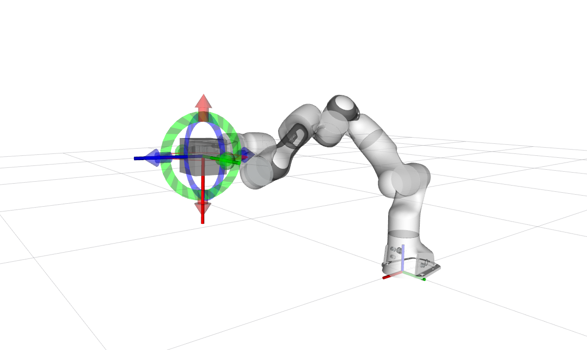

# Arms ROS2 Control

This repository contains the ros2-control files for manipulators and robotic arms. It provides controllers and hardware
interfaces for various robotic manipulators in ROS2 environment.

## Table of Contents

- [Project Structure](#project-structure)
- [Dependencies](#dependencies)
- [Supported Robots](#supported-robots)
- [Tested Environments](#tested-environments)
- [Quick Start](#quick-start)
- [Components](#components)
- [Configuration](#configuration)
- [Development](#development)
- [Troubleshooting](#troubleshooting)
- [License](#license)

## Project Structure

The project is organized as follows:

```
arms_ros2_control/
├── controller/                    # Controller implementations
│   ├── ocs2_arm_controller/      # OCS2-based arm controller
│   └── adaptive_gripper_controller/ # Adaptive gripper controller
├── hardwares/                    # Hardware interface implementations
│   ├── gz_ros2_control/         # Gazebo hardware interface
│   ├── topic_based_ros2_control/ # Topic-based hardware interface
│   └── unitree_ros2_control/    # Unitree robot hardware interface
├── command/                      # Command input implementations
│   ├── arms_ros2_control_msgs/  # Control input message definitions
│   ├── arms_rviz_control_plugin/ # RViz control plugin
│   ├── arms_target_manager/     # Target management system
│   └── arms_teleop/             # Unified teleoperation package
│       └── joystick_teleop      # Joystick-based control
└── README.md
```

## Dependencies

This package depends on:

- [`robot_descriptions`](https://github.com/fiveages-sim/robot_descriptions) - Robot description files (URDF, XACRO)
- [`ocs2_ros2`](https://github.com/legubiao/ocs2_ros2) - OCS2 ROS2 integration (required by `ocs2_arm_controller`)

**Package Placement**: Both `robot_descriptions` and `ocs2_ros2` should be placed in the `src` directory of your ROS2
workspace alongside `arms_ros2_control`:

```
open-deploy-ws/
├── src/
│   ├── robot_descriptions/        # Robot description files
│   ├── ocs2_ros2/                # OCS2 ROS2 integration
│   └── arms_ros2_control/        # This package
├── install/
└── log/
```

## Tested Environments

This package has been tested and verified to work with the following ROS2 distributions:

- **ROS2 Jazzy** (Ubuntu 24.04)

## Quick Start

<details>
<summary><strong>📥 Clone & Initialize (using init_repo.sh)</strong></summary>

Clone the deploy workspace and run the init script. It will sync submodules, init required nested submodules (e.g. `robot-descriptions/common`, `lina_planning`, `ocs2_robotic_assets`), checkout the correct branches, and run `rosdep install`:

```bash
# Clone the workspace (directory name is up to you)
git clone git@github.com:fiveages-sim/open-deploy-ws.git open-deploy-ws
cd open-deploy-ws

# One-shot init: submodules + nested submodules + branch checkout + rosdep
./init_repo.sh
./quick_start.sh
```

**What `init_repo.sh` does**:
- Syncs and inits top-level submodules: `arms_ros2_control`, `ocs2_ros2`, `robot-descriptions`
- Inits build-needed nested submodules: `robot-descriptions/common`, `arms_ros2_control/libraries/lina_planning`, `ocs2_ros2/submodules/ocs2_robotic_assets`
- Checks out each (sub)module to its configured branch and pulls latest
- Runs `rosdep install --from-paths src --ignore-src -r -y` (if `rosdep` is available)

</details>

<details>
<summary><strong>🔧 Verify OCS2 Setup (Optional)</strong></summary>

You can verify OCS2 by building and running a mobile manipulator demo:


```bash
# Franka Panda
source ~/open-deploy-ws/install/setup.bash
ros2 launch ocs2_mobile_manipulator_ros franka.launch.py
```

```bash
# Or Mabi-Mobile
source ~/open-deploy-ws/install/setup.bash
ros2 launch ocs2_mobile_manipulator_ros manipulator_mabi_mobile.launch.py
```


If any of these demos run successfully, your OCS2 environment is properly configured. See the [ocs2_mobile_manipulator_ros README](https://github.com/legubiao/ocs2_ros2/tree/ros2/basic%20examples/ocs2_mobile_manipulator_ros) for more available demos.



</details>

### 1. Build the Package

```bash
cd ~/open-deploy-ws
colcon build --packages-up-to ocs2_arm_controller cr5_description arms_teleop adaptive_gripper_controller --symlink-install
```

### 2. Launch with Mock Hardware

* OCS2 Arm Controller
  ```bash
  source ~/open-deploy-ws/install/setup.bash
  ros2 launch ocs2_arm_controller demo.launch.py type:=AG2F90-C
  ```

> **Interactive Control:**
> - Press the button to switch between OCS2 Controller FSM and toggle gripper.
> - In RViz, drag the interactive markers to set target positions, then right-click to send trajectory commands
>
> 

### 3. Launch with Gazebo Simulation

* Install Gazebo Harmonic
    ```bash
    sudo apt-get install ros-jazzy-ros-gz ros-jazzy-gz-ros2-control
    ```

#### Launch controller:
Here I used Agibot G1 as an example for other robots.
* Compile robot descriptions
  ```bash
  cd ~/open-deploy-ws
  colcon build --packages-up-to agibot_g1_description --symlink-install
  ```
* You can use `world` to choose the gazebo worlds
  ```bash
  source ~/open-deploy-ws/install/setup.bash
  ros2 launch ocs2_arm_controller demo.launch.py robot:=agibot_g1 hardware:=gz world:=warehouse
  ```
  

### 4. Launch with Isaac Sim Simulation

* Compile the enhanced topic_based_ros2_control package
  ```bash
  cd ~/open-deploy-ws
  colcon build --packages-up-to topic_based_ros2_control --symlink-install
  ```
* Launch controller (Launch Isaac Sim before this step)
  ```bash
  source ~/open-deploy-ws/install/setup.bash
  ros2 launch ocs2_arm_controller demo.launch.py hardware:=isaac type:=AG2F90-C
  ```
  

## Components

### Controllers

#### OCS2 Arm Controller

The `ocs2_arm_controller` provides MPC-based control for robotic arms using the OCS2 framework.

**Features:**

- Model Predictive Control (MPC) for trajectory tracking
- Real-time optimization
- Support for various robot configurations

#### Adaptive Gripper Controller

The `adaptive_gripper_controller` provides basic gripper control functionality with position reading and output capabilities.

**Features:**

- Position reading from hardware interface
- Position command output to hardware interface
- Basic gripper position control
- Easy to understand and extend

### Hardware Interfaces

#### Gazebo Hardware Interface

The `gz_ros2_control` package provides hardware interface for Gazebo simulation. Origin version could be found at [gz ros2 control](https://github.com/ros-controls/gz_ros2_control).

**Features:**

- Real-time simulation integration
- Support for various Gazebo plugins
- Configurable world files

#### Topic-based Hardware Interface

The `topic_based_ros2_control` package provides a generic hardware interface that communicates via ROS2 topics. Origin version could be found at [topic based ros2 control](https://github.com/PickNikRobotics/topic_based_ros2_control).

**Features:**

- Generic interface for any hardware
- Topic-based communication
- Easy integration with custom hardware

#### Unitree Hardware Interface

The `unitree_ros2_control` package provides hardware interface for Unitree robots based on unitree_sdk2.

**Features:**

- Support for Unitree G1 and other sdk2-compatible robots
- Mujoco simulation integration
- Real robot support

### Command Input Systems

#### Arms RViz Control Plugin

The `arms_rviz_control_plugin` provides an intelligent RViz plugin that combines control for both OCS2 Arm Controller and Adaptive Gripper Controller.

**Features:**

- **OCS2 Arm Controller Control:**
  - Smart FSM state display and switching
  - Dynamic button control showing only available state transitions
  - Proper state transition following OCS2 Arm Controller FSM rules
  - HOLD initial state with proper state flow
  - Pose switching functionality in HOME state
- **Gripper Controller Control:**
  - Left and right gripper control buttons
  - Real-time gripper state display
  - Single/dual arm gripper support
  - Automatic controller detection and UI adaptation

#### Arms Target Manager

The `arms_target_manager` provides 3D interactive markers for setting robotic arm end-effector target poses.

**Features:**

- 3D interactive markers in RViz
- Single/dual arm support
- VR Teleop Support
- Joystick Teleop Support

#### Arms Teleop

The `arms_teleop` package provides unified teleoperation capabilities for robotic arms.

**Features:**

- Joystick-based control
- Keyboard-based control
- Unified interface for different input methods

## Configuration

### Robot Configuration

Robot-specific configurations are stored in the `robot_descriptions` package. Each robot has its own description package
with:

- URDF/XACRO files
- Configuration files
- Mesh files

### Controller Configuration

Controller configurations are stored in the respective controller packages:

- `ocs2_arm_controller/config/` - OCS2 controller configurations
- Hardware-specific configurations in hardware interface packages

## Development

### Adding a New Robot

1. Add robot description to `robot_descriptions/manipulator/`
2. Create configuration files in the appropriate controller package
3. Update launch files to include the new robot
4. Test with both mock and simulator hardware before move to real robot

### Adding a New Controller

1. Create a new package in the `controller/` directory
2. Implement the controller interface
3. Add configuration and launch files
4. Update this README with usage instructions

## Troubleshooting

### Common Issues

1. **Build Errors**: Ensure all dependencies are installed and built
2. **Launch Errors**: Check that robot descriptions are properly installed
3. **Hardware Connection**: Verify hardware interface configuration

### Getting Help

- Check the individual package README files for specific instructions
- Review the `ocs2_ros2` documentation for OCS2-specific issues
- Check the `robot_descriptions` package for robot-specific configurations

## License

This package is licensed under the Apache License 2.0. See the [LICENSE](LICENSE) file for details.